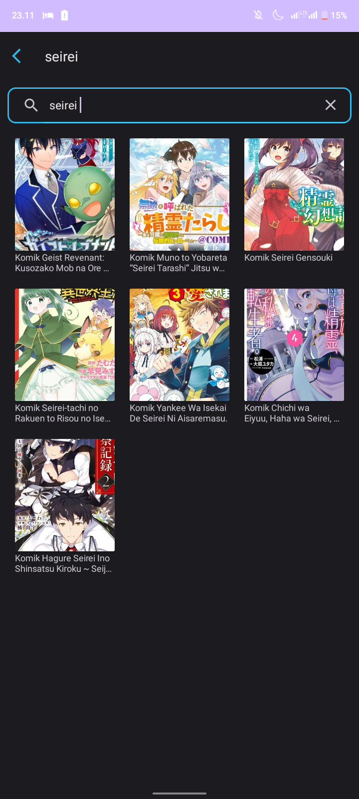

# KomikU Apps

Data dari app ini diambil dari Api https://github.com/KatowProject/komikato_py,
Jika app tidak berfungsi mungkin api yg digunakan oleh app ini sudah mati

# App Features
- Release / update terbaru
- Komik Jepang
- Komik Korea
- Komik China
- Pencarian Komik 
- Genre yang lengkap

## Authors 

- [@Ridho](https://github.com/Ridhoardhiansyah7/)
- [@WhatsApp](https://api.whatsapp.com/send/?phone=0895323021645&text&type=phone_number&app_absent=0)
- [@Telegram](https://t.me/ridh704)


## 🚀 Tentang saya
Saat ini saya sedang belajar mengembangkan app menggunakan android studio dengan bahasa Java dan kotlin, pada saat app ini dibuat umur saya 17 tahun.


## Installation

Install my-project with android studio
```bash
  - Download / salin tautan project ini terlebih dahulu
  - Buka android studio, kemudian pilih Get from VCS
  - paste urL project ini / buka from directory dan navigasikan ke projek ini 
```
    
## 🛠 Skill
Java.

## Screenshots

### Bagian Fragment Home Atas


### Bagian Fragment Home Bawah


### Bagian Fragment Favorite


### Bagian Fragment Riwayat

 
### Bagian Fragment Pegaturan


### Bagian Halaman Detail Genre


### Bagian Halaman Cari Komik



### Bagian Halaman Detail Komik


### Bagian Halaman Baca Komik


